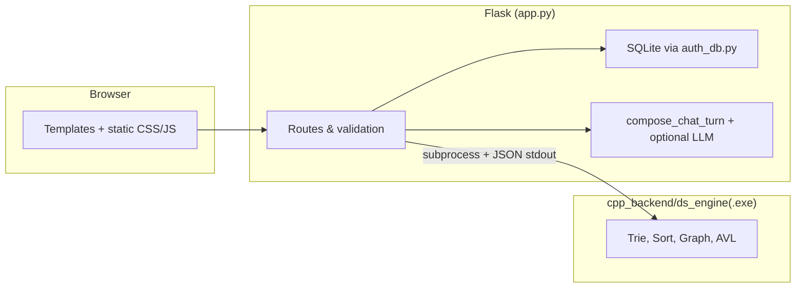

# FinPilot DS

**FinPilot DS** is a full-stack **financial intelligence simulation** for coursework and demos: a Flask web app with sessions-based auth, dashboards, stock search (backed by a **C++ trie**), portfolio-style **optimizer** visualizations, **PDF analysis exports**, a **route-aware chatbot** with optional LLM integration, and an **Algorithms Lab** that drives sorting, graphs, AVL trees, and trie operations through a compiled **C++17 engine** returning JSON to Python.

<p align="center">
  <a href="https://github.com/AtharvGore14/DSChatbot"><strong>github.com/AtharvGore14/DSChatbot</strong></a>
</p>

<p align="center">
  
  
  
  
</p>

---

## Table of contents

- [Why this project](#why-this-project)
- [What you can do (feature tour)](#what-you-can-do-feature-tour)
- [Architecture](#architecture)
- [Tech stack](#tech-stack)
- [Repository layout](#repository-layout)
- [Prerequisites](#prerequisites)
- [Installation](#installation)
- [Configuration & environment variables](#configuration--environment-variables)
- [Running the application](#running-the-application)
- [C++ data structures engine](#c-data-structures-engine)
- [REST API reference](#rest-api-reference)
- [Chatbot: local vs external LLM](#chatbot-local-vs-external-llm)
- [Security & production](#security--production)
- [Disclaimer](#disclaimer)
- [Troubleshooting](#troubleshooting)
- [Author](#author)

---

## Why this project

FinPilot DS applies **data structures and algorithms in a realistic UI shell**: Flask handles HTTP, sessions, and templates; a **subprocess-spawned C++ binary** runs CPU-heavy structures (trie, sorts, graph traversals, AVL) and streams results back as **JSON** for charts and tables.

The **About** page in the app describes two scopes:

- **Academic:** AVL, trie, heap, graph algorithms, BST/stack/queue concepts, sorting/searching — exercised through `/demo` and `/api/ds/*`.
- **Product-style:** dashboards, watchlist-style catalog, compare cohorts, risk-template optimizer, chatbot — useful for presentations and portfolios, with clear boundaries on what is simulated vs live.

> Numbers shown for equities in this build are tied to an in-code **`STOCKS`** snapshot for reproducible demos. The chatbot’s external LLM mode is instructed to **not invent prices** outside that catalog when answering about tickers.

---

## What you can do (feature tour)

| Area | Route(s) | Description |
|------|------------|-------------|
| **Landing** | `/` | Hero metrics (catalog size, advancers/decliners) for the static snapshot. |
| **Auth** | `/register`, `/login`, `/logout` | Email + password (min length enforced). Passwords hashed with Werkzeug. SQLite DB created automatically beside `auth_db.py`. |
| **Dashboard** | `/dashboard` | **Login required.** Entry hub after sign-in. |
| **Search** | `/search` | Symbol lookup: exact match and **prefix suggestions via C++ trie** (`run_cpp_engine`). |
| **Analysis** | `/analysis` | **Login required.** Analytical views; **PDF download** at `/analysis/export` (user-aware filenames). |
| **Compare** | `/compare` | **Login required.** Multi-symbol comparison and chart-oriented summaries. |
| **Optimizer** | `/optimizer` | **Login required.** Budget, **risk** (Low/Medium/High), **horizon** (12–60 months), **goal** (growth/income/balanced). Allocation sleeves, radar/MC-style **deterministic coursework visuals** (not a forecast). JSON preview: `/api/optimizer/preview`. |
| **Chatbot** | `/chatbot`, `/api/chatbot` | Conversational UI with **session-stored history** (last 8 turns). **Local** keyword routing plus optional **OpenAI-compatible** API. |
| **Algorithms Lab** | `/demo` | Pick sort algo (**merge / quick / heap**) and graph walk (**BFS / DFS / Dijkstra**); results from C++ engine. |
| **Admin** | `/admin` | **Login required.** Administrative surface (see app for behavior). |
| **About** | `/about` | Project vision and scope. |

**Session protection:** `dashboard`, `analysis`, `analysis_export`, `compare`, `optimizer`, `optimizer_preview`, and `admin` redirect to login when unauthenticated.

---

## Architecture



---

## Tech stack

| Layer | Details |
|-------|---------|
| **Runtime** | Python 3 (3.10+ recommended), Flask 3.x-compatible |
| **Auth DB** | SQLite (`finpilot_users.db`), schema in `auth_db.init_db()` |
| **Engine** | C++17, compiled to `cpp_backend/ds_engine.exe` (Windows artifact in repo) |
| **Numerics / export** | NumPy, Pandas, **fpdf2** for PDFs |
| **Optional deps** | `yfinance` is listed in `requirements.txt` for future or auxiliary scripts — core routes use the static `STOCKS` catalog |

---

## Repository layout

```
├── app.py                 # Flask application: routes, chatbot, market stubs, C++ bridge
├── auth_db.py             # SQLite helpers for users
├── requirements.txt
├── README.md
├── .gitignore             # Excludes .venv, __pycache__, *.db, .env
├── cpp_backend/
│   ├── data_structures.cpp   # Trie, sorts, graph, AVL — JSON on stdout
│   └── ds_engine.exe         # Prebuilt Windows binary (rebuild on other OS)
├── database/              # Placeholder / data folder usage as needed
├── static/
│   ├── css/style.css
│   ├── js/main.js
│   └── img/
└── templates/             # Jinja2 pages (base, dashboard, chatbot, optimizer, …)
```

---

## Prerequisites

- **Python 3.10+**
- **pip** and a virtual environment (recommended)
- **g++** with **C++17** support — only if you **recompile** the engine (required on non-Windows or after source changes)
- On Windows, the bundled `ds_engine.exe` runs as-is; on Linux/macOS you must build a binary and align `CPP_ENGINE` in `app.py` (see below)

---

## Installation

### 1. Clone

```bash
git clone https://github.com/AtharvGore14/DSChatbot.git
cd DSChatbot
```

### 2. Virtual environment & dependencies

**Windows (PowerShell)** — avoids execution-policy issues with `Activate.ps1` by calling the venv interpreter directly:

```powershell
python -m venv .venv
.\.venv\Scripts\python.exe -m pip install --upgrade pip
.\.venv\Scripts\python.exe -m pip install -r requirements.txt
```

**macOS / Linux**

```bash
python3 -m venv .venv
source .venv/bin/activate
pip install --upgrade pip
pip install -r requirements.txt
```

---

## Configuration & environment variables

| Variable | Required | Description |
|----------|----------|-------------|
| `FLASK_SECRET_KEY` | **Strongly recommended in production** | Signs session cookies. Default in code is a development placeholder. |
| `CHAT_API_URL` | Optional | OpenAI-compatible chat Completions URL (e.g. OpenAI or Groq). |
| `CHAT_API_KEY` | Optional | Bearer token for that API. If unset, chatbot uses **local** rules only. |
| `CHAT_MODEL` | Optional | Model name (default `gpt-4o-mini`). |
| `CHAT_HTTP_TIMEOUT` | Optional | Seconds (clamped 5–120, default 25). |

Example (PowerShell) for **Groq** (OpenAI-compatible):

```powershell
$env:CHAT_API_URL = "https://api.groq.com/openai/v1/chat/completions"
$env:CHAT_API_KEY = "your-key"
$env:CHAT_MODEL = "llama-3.3-70b-versatile"
```

The external path sends a **system prompt** that embeds the static **STOCKS** catalog so the model does not hallucinate prices for in-app tickers.

---

## Running the application

From the project root:

```bash
python app.py
```

Default URL: **http://127.0.0.1:5000/**

Alternative using Flask CLI:

```powershell
# Windows CMD
set FLASK_APP=app
flask run --debug
```

```bash
# macOS / Linux
export FLASK_APP=app
flask run --debug
```

---

## C++ data structures engine

- **Source:** `cpp_backend/data_structures.cpp`
- **Bridge:** `run_cpp_engine()` in `app.py` runs `[CPP_ENGINE, ...args]`, reads **JSON from stdout**, 10s timeout.
- **Windows:** `CPP_ENGINE` points to `cpp_backend/ds_engine.exe` (included).
- **Rebuild (Windows):**

  ```bash
  g++ -std=c++17 -O2 -o cpp_backend/ds_engine.exe cpp_backend/data_structures.cpp
  ```

- **Linux / macOS:** compile to e.g. `cpp_backend/ds_engine` and update:

  ```python
  CPP_ENGINE = BASE_DIR / "cpp_backend" / "ds_engine"
  ```

**Implemented commands (via REST wrappers):** health, **trie** (prefix), **sort** (merge/quick/heap), **graph** (bfs/dfs/dijkstra), **avl**.

**Input limits (server-side):** sort CSV up to **64** integers; AVL up to **48**; trie prefix and graph start node validated by regex in `app.py`.

---

## REST API reference

Base: `http://127.0.0.1:5000`

### Data structures (`/api/ds/<command>`)

| Command | Method | Query parameters | Notes |
|---------|--------|-------------------|--------|
| `health` | GET | — | Engine alive check |
| `trie` | GET | `prefix` | Uppercase alphanumerics / `.` / `-`, length 1–20 |
| `sort` | GET | `algo` ∈ `merge`,`quick`,`heap`; `data` = comma-separated ints | Max 64 values |
| `graph` | GET | `algo` ∈ `bfs`,`dfs`,`dijkstra`; `start` = A–Z label (1–12 chars) | Fixed demo graph in engine |
| `avl` | GET | `data` = comma-separated ints | Max 48 values |

### Optimizer

| Endpoint | Method | Parameters |
|----------|--------|------------|
| `/api/optimizer/preview` | GET | `budget`, `risk` (Low/Medium/High), `horizon` (12/24/36/60), `goal` (growth/income/balanced) |

Returns JSON including allocation and chart-friendly structures.

### Chatbot

| Endpoint | Method | Body / session |
|----------|--------|----------------|
| `/api/chatbot` | POST | JSON `{"q": "..."}` — updates session history |

### Market stubs (sample data)

| Endpoint | Description |
|----------|-------------|
| `/api/market/gainers` | Top movers from static catalog (`limit` 1–20) |
| `/api/market/sectors` | Sector-strength style payload |
| `/api/market/overview` | Breadth, pulse, buckets — derived from `STOCKS` |

---

## Chatbot: local vs external LLM

1. **Local (`provider: local`):** Rule-based responses from `build_chatbot_response()` — tickers, comparisons, volatility, coursework hints, etc.
2. **External (`provider: external`):** Used when both `CHAT_API_URL` and `CHAT_API_KEY` are set and the HTTP call succeeds; otherwise falls back to local.

History is trimmed to **8** turns; max query length **200** characters.

---

## Security & production

- Replace **`FLASK_SECRET_KEY`** and never commit secrets.
- **`finpilot_users.db`** is gitignored — each deployment creates its own users unless you ship a DB intentionally.
- Do **not** expose `app.run(debug=True)` or `flask run --debug` on the public internet; use a **WSGI server** (e.g. Gunicorn + Nginx) and HTTPS.
- Treat optimizer and market JSON as **educational / illustrative**, not investment advice.

---

## Disclaimer

This software is for **education and demonstration**. It is **not** financial advice. Optimizer outputs, Monte-Carlo-style stubs, and static prices are **not** live market data or performance guarantees.

---

## Troubleshooting

| Issue | What to try |
|-------|-------------|
| `ModuleNotFoundError: flask` | Install deps inside your venv; use `.\.venv\Scripts\python.exe` on Windows. |
| `No module named 'flask'` with system Python | You are not using the venv interpreter. |
| C++ engine errors on Linux/macOS | Build `ds_engine` from `.cpp` and fix `CPP_ENGINE` path; `.exe` is Windows-only. |
| Chatbot always `local` | Set `CHAT_API_URL` and `CHAT_API_KEY`; check firewall and API errors. |
| PowerShell won’t `Activate.ps1` | Use `.\.venv\Scripts\python.exe` directly (see Installation). |

---

## Author

**Atharv Gore**

- **Repository:** [github.com/AtharvGore14/DSChatbot](https://github.com/AtharvGore14/DSChatbot)

If this project helps your coursework or portfolio, a star on the repo is appreciated.
