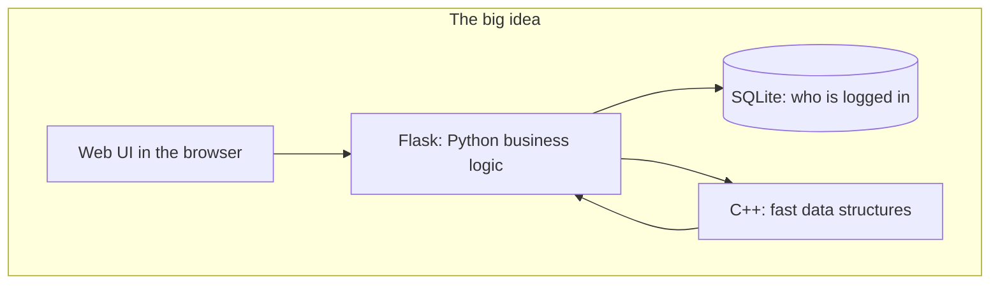
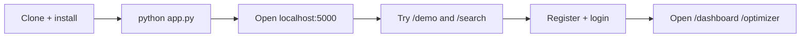
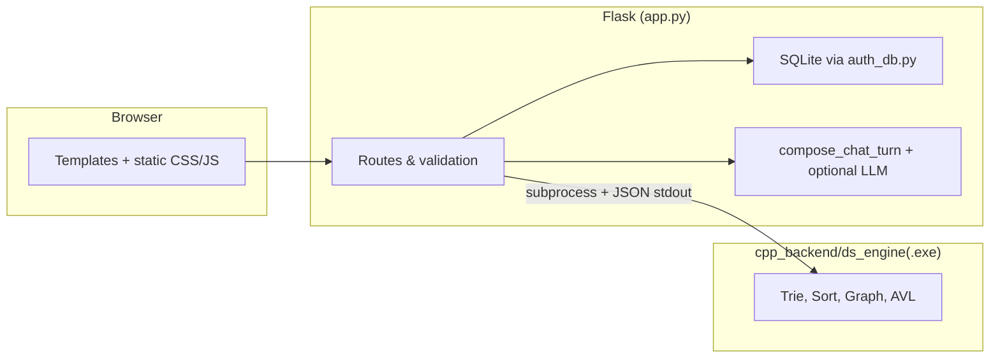
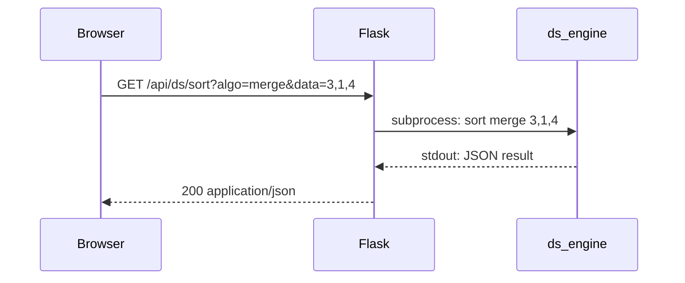

<p align="center">
  
</p>

<h1 align="center">FinPilot DS</h1>

<p align="center"><strong>Learn how a modern web app mixes Python, SQLite, and a C++ “algorithm engine” — with a finance-themed UI.</strong></p>

<p align="center">
  <a href="https://github.com/AtharvGore14/DSChatbot"><strong>github.com/AtharvGore14/DSChatbot</strong></a>
</p>

<p align="center">
  
  
  
  
</p>

---

## Start here if you are new

| You are… | Read this first |
|----------|-----------------|
| **A student / first-time visitor** | The [30-second summary](#30-second-summary) and [What is this, really?](#what-is-this-really) |
| **Trying to run it on your PC** | [Run in 4 steps](#run-in-4-steps) |
| **A developer** | [Architecture](#architecture) and [Repository layout](#repository-layout) |
| **Using the HTTP APIs** | [REST API reference](#rest-api-reference) |

> [!NOTE]
> **Stock prices in the app are a fixed in-code “snapshot”** (`STOCKS` in `app.py`) so demos are repeatable. This is **not** a live trading or brokerage product.

> [!TIP]
> **Optional smart chat:** set `CHAT_API_URL` + `CHAT_API_KEY` for an OpenAI-style API (e.g. OpenAI or Groq). Without them, the chatbot still works using **built-in rules** on your machine.

---

## 30-second summary

1. **You open a website** (Flask serves pages and static files).  
2. **You can register and log in** — user data lives in a small **SQLite** file.  
3. **Heavy algorithms** (trie, sorting, graphs, AVL) run in a **C++ program**; Python **starts that program**, reads **JSON** from it, and shows results in the UI.  
4. **Extra pages** (analysis, compare, optimizer) need **login**; search, demo, and chatbot are available without an account (see map below).

---

## What is this, really?



- **“FinPilot”** = a *simulated* fintech-style experience: dashboards, search, compare, portfolio-style **optimizer** (illustrative, not advice).  
- **“DS”** = **data structures**: the same ideas you study in CS, wired to real HTTP routes and JSON.

---

## Page map (where to go in the app)

<p align="center">
  
</p>

| If you want to… | Go to… |
|-----------------|--------|
| See algorithms without logging in | **`/demo`** (sort + graph) |
| Try prefix search (trie) | **`/search`** |
| Use the chatbot | **`/chatbot`** |
| PDF analysis & optimizer | **Register → login** → `/analysis`, `/optimizer` |

---

## Your first 5 minutes (recommended path)



1. Install dependencies (see [Installation](#installation)).  
2. Run `python app.py`.  
3. Visit **http://127.0.0.1:5000** .  
4. Open **`/demo`** and **`/search`** (no account).  
5. **Register**, then explore **dashboard**, **analysis**, **compare**, **optimizer**.

---

## Run in 4 steps

| Step | Action |
|------|--------|
| 1 | `git clone https://github.com/AtharvGore14/DSChatbot.git` and `cd DSChatbot` |
| 2 | Create a venv and `pip install -r requirements.txt` |
| 3 | From the project folder, run `python app.py` |
| 4 | Browser: **http://127.0.0.1:5000** |

**Windows (copy-paste):**

```powershell
python -m venv .venv
.\.venv\Scripts\python.exe -m pip install -r requirements.txt
.\.venv\Scripts\python.exe app.py
```

If `Activate.ps1` is blocked, keep using `.\.venv\Scripts\python.exe` — no activation needed.

---

## Table of contents

- [Start here if you are new](#start-here-if-you-are-new)
- [30-second summary](#30-second-summary)
- [What is this, really?](#what-is-this-really)
- [Page map](#page-map-where-to-go-in-the-app)
- [Your first 5 minutes](#your-first-5-minutes-recommended-path)
- [Run in 4 steps](#run-in-4-steps)
- [Why this project](#why-this-project)
- [What you can do (feature tour)](#what-you-can-do-feature-tour)
- [Architecture](#architecture)
- [How the C++ engine is called (sequence)](#how-the-c-engine-is-called-sequence)
- [Tech stack](#tech-stack)
- [Repository layout](#repository-layout)
- [Prerequisites](#prerequisites)
- [Installation](#installation)
- [Configuration & environment variables](#configuration--environment-variables)
- [Running the application](#running-the-application)
- [C++ data structures engine](#c-data-structures-engine)
- [REST API reference](#rest-api-reference)
- [Chatbot: local vs external LLM](#chatbot-local-vs-external-llm)
- [Security & production](#security--production)
- [Disclaimer](#disclaimer)
- [Troubleshooting](#troubleshooting)
- [Author](#author)

---

## Why this project

FinPilot DS applies **data structures and algorithms inside a realistic UI**: Flask handles HTTP, sessions, and templates; a **C++ binary** runs trie, sorts, graph traversals, and AVL; results return as **JSON** for tables and charts.

The in-app **About** page describes two scopes:

- **Academic:** AVL, trie, heap, graphs — via `/demo` and `/api/ds/*`.  
- **Product-style:** dashboards, catalog search, compare, optimizer, chatbot — good for portfolios and presentations, with clear limits on what is simulated.

---

## What you can do (feature tour)

| Area | Route(s) | Description |
|------|------------|-------------|
| **Landing** | `/` | Snapshot metrics (catalog size, advancers/decliners). |
| **Auth** | `/register`, `/login`, `/logout` | Email + password; hashed; SQLite DB auto-created. |
| **Dashboard** | `/dashboard` | **Login required.** Hub after sign-in. |
| **Search** | `/search` | Exact match + **prefix suggestions via C++ trie**. |
| **Analysis** | `/analysis` | **Login required.** Views + **PDF** at `/analysis/export`. |
| **Compare** | `/compare` | **Login required.** Multi-symbol comparison. |
| **Optimizer** | `/optimizer` | **Login required.** Budget, risk, horizon, goal — illustrative charts. Preview: `/api/optimizer/preview`. |
| **Chatbot** | `/chatbot`, `/api/chatbot` | Session history; **local** rules + optional **LLM**. |
| **Algorithms Lab** | `/demo` | Sort (**merge / quick / heap**) + graph (**BFS / DFS / Dijkstra**). |
| **Admin** | `/admin` | **Login required.** |
| **About** | `/about` | Vision and scope. |

Protected routes redirect to **login** when logged out: `dashboard`, `analysis`, `analysis_export`, `compare`, `optimizer`, `optimizer_preview`, `admin`.

---

## Architecture



---

## How the C++ engine is called (sequence)



---

## Tech stack

| Layer | Details |
|-------|---------|
| **Runtime** | Python 3.10+, Flask |
| **Auth DB** | SQLite (`finpilot_users.db`) |
| **Engine** | C++17 → `ds_engine.exe` (Windows in repo) |
| **Export** | NumPy, Pandas, **fpdf2** |
| **Deps note** | `yfinance` is in `requirements.txt` for possible extensions; core UI uses the static `STOCKS` list |

---

## Repository layout

```
├── app.py                 # Flask app, routes, C++ bridge, chatbot
├── auth_db.py             # SQLite user helpers
├── requirements.txt
├── docs/readme/           # SVG diagrams for this README
├── cpp_backend/
│   ├── data_structures.cpp
│   └── ds_engine.exe      # Windows binary — rebuild on Linux/macOS
├── static/                # css, js, images
└── templates/             # Jinja2 HTML
```

---

## Prerequisites

- Python **3.10+**
- **pip** + virtualenv recommended  
- **g++** with C++17 — only to **recompile** the engine (required on non-Windows)

---

## Installation

### 1. Clone

```bash
git clone https://github.com/AtharvGore14/DSChatbot.git
cd DSChatbot
```

### 2. Virtual environment & dependencies

**Windows (PowerShell)**

```powershell
python -m venv .venv
.\.venv\Scripts\python.exe -m pip install --upgrade pip
.\.venv\Scripts\python.exe -m pip install -r requirements.txt
```

**macOS / Linux**

```bash
python3 -m venv .venv
source .venv/bin/activate
pip install --upgrade pip
pip install -r requirements.txt
```

---

## Configuration & environment variables

| Variable | Required | Description |
|----------|----------|-------------|
| `FLASK_SECRET_KEY` | **Production: yes** | Session signing (dev default is placeholder). |
| `CHAT_API_URL` | No | OpenAI-compatible chat URL. |
| `CHAT_API_KEY` | No | API key; if missing → **local** chat only. |
| `CHAT_MODEL` | No | Default `gpt-4o-mini`. |
| `CHAT_HTTP_TIMEOUT` | No | Seconds 5–120, default 25. |

**Groq example (PowerShell):**

```powershell
$env:CHAT_API_URL = "https://api.groq.com/openai/v1/chat/completions"
$env:CHAT_API_KEY = "your-key"
$env:CHAT_MODEL = "llama-3.3-70b-versatile"
```

External LLM calls include a **system prompt** with the static **STOCKS** table so ticker answers stay consistent.

---

## Running the application

```bash
python app.py
```

Open **http://127.0.0.1:5000/**

**Flask CLI:**

```powershell
set FLASK_APP=app
flask run --debug
```

```bash
export FLASK_APP=app
flask run --debug
```

---

## C++ data structures engine

| Item | Detail |
|------|--------|
| **Source** | `cpp_backend/data_structures.cpp` |
| **Bridge** | `run_cpp_engine()` runs the binary, parses **JSON** from stdout (10s timeout). |
| **Windows** | Uses `cpp_backend/ds_engine.exe` (bundled). |
| **Rebuild** | `g++ -std=c++17 -O2 -o cpp_backend/ds_engine.exe cpp_backend/data_structures.cpp` |
| **Linux/macOS** | Build `ds_engine` (no `.exe`) and set `CPP_ENGINE` in `app.py`. |

**Commands exposed via `/api/ds/*`:** health, trie, sort, graph, avl.

**Limits:** up to **64** ints for sort; **48** for AVL; validated prefixes / graph start in `app.py`.

---

## REST API reference

**Base:** `http://127.0.0.1:5000`

### Data structures — `/api/ds/<command>`

| Command | GET params | Notes |
|---------|------------|--------|
| `health` | — | Engine check |
| `trie` | `prefix` | 1–20 chars, allowed charset |
| `sort` | `algo`, `data` | `merge` `quick` `heap`; CSV ints |
| `graph` | `algo`, `start` | `bfs` `dfs` `dijkstra`; start node label |
| `avl` | `data` | CSV ints |

### Other

| Endpoint | Purpose |
|----------|---------|
| `/api/optimizer/preview` | GET — budget, risk, horizon, goal → JSON plan |
| `/api/chatbot` | POST `{"q":"..."}` — session history |
| `/api/market/gainers` | Sample movers |
| `/api/market/sectors` | Sector payload |
| `/api/market/overview` | Overview bundle |

---

## Chatbot: local vs external LLM

1. **Local** — rule-based `build_chatbot_response()` when no API or API fails.  
2. **External** — when `CHAT_API_URL` and `CHAT_API_KEY` work; responses labeled `provider: external`.

History: last **8** turns; queries max **200** characters.

---

## Security & production

- Set a strong **`FLASK_SECRET_KEY`**.  
- **`finpilot_users.db`** is gitignored per clone.  
- Do not ship **`debug=True`** to the public internet; use a **WSGI** server + HTTPS.  
- Optimizer output is **not** investment advice.

---

## Disclaimer

This project is for **education and demonstration**. It is **not** financial advice. Prices and optimizer visuals are **illustrative**, not live guarantees.

---

## Troubleshooting

| Symptom | Fix |
|---------|-----|
| `No module named 'flask'` | Use the venv interpreter: `.\.venv\Scripts\python.exe` (Windows). |
| Engine errors on Linux/macOS | Compile `ds_engine` and update `CPP_ENGINE` — `.exe` is Windows-only. |
| Chatbot stuck on local | Set `CHAT_API_URL` + `CHAT_API_KEY`; check network and API errors. |
| `Activate.ps1` blocked | Call `.\.venv\Scripts\python.exe` directly. |

---

## Author

**Atharv Gore** · [github.com/AtharvGore14/DSChatbot](https://github.com/AtharvGore14/DSChatbot)
